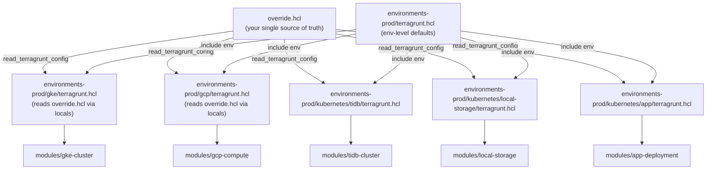
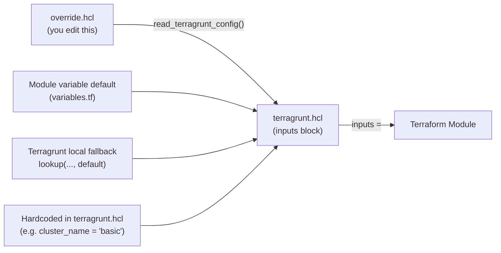

# 📚 Infrastructure KT — Full Module Reference

> **Stack**: GCP + GKE + TiDB + Protecto App  
> **IaC Tool**: Terraform (modules) + Terragrunt (orchestration)  
> **Environments**: `dev` | `prod`

---

## 1. How Configuration Flows (Big Picture)



> [!IMPORTANT]
> **[override.hcl](file:///home/protecto/poc/gcp/terraform-infra/test-app/gcp/environments-dev/override.hcl)** is the **one file you edit** for each environment. All [terragrunt.hcl](file:///home/protecto/poc/gcp/terraform-infra/test-app/gcp/terragrunt.hcl) files read it via `read_terragrunt_config(find_in_parent_folders("override.hcl"))`. You **never** touch module [variables.tf](file:///home/protecto/poc/gcp/terraform-infra/test-app/gcp/shared/variables.tf) directly.

---

## 2. Deployment Order

Each step depends on the previous one:

```
Step 1 → gke-cluster     (creates the GKE cluster + all node pools)
Step 2 → gcp-compute     (creates & attaches persistent disks to nodes)
Step 3 → local-storage   (deploys local-volume-provisioner DaemonSet + StorageClass)
Step 4 → tidb-cluster    (installs TiDB Operator + deploys TidbCluster CR)
Step 5 → app-deployment  (deploys Protecto application pods & secrets)
```

---

## 3. Module: `gke-cluster`

**What it does:** Creates the GKE cluster and **all 6 node pools**:
`admin-pool`, `pd-pool`, `tikv-pool`, `tidb-pool`, `gpu-pool`, `bignode-pool`

**Terragrunt entry:** [environments-prod/gke/terragrunt.hcl](file:///home/protecto/poc/gcp/terraform-infra/test-app/gcp/environments-prod/gke/terragrunt.hcl)  
**Module source:** `modules/gke-cluster/`

### Node Pools Created

| Pool Name (prod) | Label `dedicated` | Taint | Purpose |
|---|---|---|---|
| `aai-prod-admin-pool` | `node-role=admin` | none | Operators, dashboards |
| `aai-prod-pd-pool` | `dedicated=pd` | `dedicated=pd:NoSchedule` | TiDB PD (Placement Driver) |
| `aai-prod-tikv-pool` | `dedicated=tikv` | `dedicated=tikv:NoSchedule` | TiDB TiKV (Storage) |
| `aai-prod-tidb-pool` | `dedicated=tidb` | `dedicated=tidb:NoSchedule` | TiDB (Query Layer) |
| `aai-prod-gpu-pool` | `dedicated=gpu` | none | ML Service (GPU workloads) |
| `aai-prod-bignode-pool` | `cloud.google.com/gke-nodepool=bignode` | none | Protecto app pods |

> [!NOTE]
> Pool name formula = `${cluster_name}-<role>-pool`. So `cluster_name = "aai-prod"` → `aai-prod-pd-pool`, etc.

### All Variables

| Variable | Default (module) | Prod Override ([override.hcl](file:///home/protecto/poc/gcp/terraform-infra/test-app/gcp/environments-dev/override.hcl)) | Description |
|---|---|---|---|
| `gcp_project_id` | **required** | `"bastion-support"` | GCP project |
| `gcp_region` | `"us-central1"` | `"us-central1"` | GCP region |
| `gcp_zone` | `"us-central1-a"` | `"us-central1-a"` | GCP zone |
| `cluster_name` | `"aai"` | `"aai-prod"` | **Base name for all pool names** |
| `is_regional` | `false` | `true` | 3-AZ regional cluster |
| `pd_node_count` | `1` | `1` (×3 zones = 3 total) | PD nodes per zone |
| `tikv_node_count` | `1` | `1` (×3 zones = 3 total) | TiKV nodes per zone |
| `tidb_node_count` | `1` | `1` (×2 zones = 2 total) | TiDB nodes per zone |
| `tidb_node_locations` | `[]` (all zones) | `["us-central1-a","us-central1-b"]` | Restricts TiDB to 2 zones |
| `admin_node_machine_type` | `"e2-standard-4"` | `"e2-standard-4"` | Admin pool machine |
| `pd_node_machine_type` | `"n2-standard-4"` | `"n1-standard-8"` | PD pool machine |
| `tikv_node_machine_type` | `"n2-highmem-8"` | `"n1-standard-8"` | TiKV pool machine |
| `tidb_node_machine_type` | `"n2-standard-8"` | `"n1-standard-4"` | TiDB pool machine |
| `gpu_node_machine_type` | `"a2-highgpu-1g"` | `"a2-highgpu-1g"` | GPU pool machine |
| `bignode_machine_type` | `"e2-standard-4"` | `"e2-standard-4"` | Bignode machine |
| `bignode_min_count` | `3` | `3` | Bignode autoscale min |
| `bignode_max_count` | `10` | `5` | Bignode autoscale max |
| `node_disk_size` | `100` | `100` | OS disk size (GB) |
| `min_node_count` | `1` | *(from module default)* | Pool autoscale min |
| `max_node_count` | `5` | *(from module default)* | Pool autoscale max |
| `labels` | `{managed-by=terraform}` | `+environment=prod` | GCP resource labels |

---

## 4. Module: `gcp-compute`

**What it does:** Creates and attaches **persistent SSD disks** to PD and TiKV nodes. These disks are mounted at `/mnt/disks/new_tidb_data` and used as local storage for TiDB.

**Terragrunt entry:** [environments-prod/gcp/terragrunt.hcl](file:///home/protecto/poc/gcp/terraform-infra/test-app/gcp/environments-prod/gcp/terragrunt.hcl)  
**Module source:** `modules/gcp-compute/`

### All Variables

| Variable | Default (module) | Prod Override | Description |
|---|---|---|---|
| `gcp_project_id` | **required** | `"bastion-support"` | GCP project |
| `gcp_region` | `"us-central1"` | `"us-central1"` | Region |
| `gcp_zone` | `"us-central1-a"` | `"us-central1-a"` | Zone |
| `cluster_name` | `"aai"` | `"aai-prod"` | Used to find GKE nodes by label |
| `environment` | **required** | `"prod"` | Must be `dev`, `staging`, or `prod` |
| `pd_disk_size` | `250` | `250` | PD disk size in GB |
| `tikv_disk_size` | `500` | `500` | TiKV disk size in GB |
| `enable_disk_attachment` | `true` | `true` | Auto-attach disks to nodes |
| `run_disk_init_script` | `false` | `false` | Run format/mount script on node |
| `remote_mount_base` | `"/mnt/disks"` | `"/mnt/disks/new_tidb_data"` | Mount path base |
| `is_regional` | `false` | `true` | Affects how nodes are discovered |
| `labels` | `{managed-by=terraform}` | `+environment=prod` | Resource labels |

> [!NOTE]
> `run_disk_init_script = false` means disks are **attached** to VMs but the format/mount script is **not** run by Terraform. The local-storage provisioner handles volume discovery instead.

---

## 5. Module: `tidb-cluster`

**What it does:** Installs the **TiDB Operator** (via Helm) and deploys the `TidbCluster` Kubernetes custom resource, which creates PD/TiKV/TiDB pods.

**Terragrunt entry:** [environments-prod/kubernetes/tidb/terragrunt.hcl](file:///home/protecto/poc/gcp/terraform-infra/test-app/gcp/environments-prod/kubernetes/tidb/terragrunt.hcl)  
**Module source:** `modules/tidb-cluster/`

> [!IMPORTANT]
> **Depends on:** `local-storage` must be ready first (declared via `dependencies { paths = ["../local-storage"] }`).

### TiDB Internal Naming

The TiDB cluster name inside Kubernetes is **hardcoded to `"basic"`** in the terragrunt local:
```hcl
cluster_name = "basic"   # → pods are named basic-pd-0, basic-tikv-0, basic-tidb-0
```
Namespaces are `tidb-cluster` (data pods) and `tidb-admin` (operator).

### All Variables

| Variable | Default (module) | Prod Override | Description |
|---|---|---|---|
| `tidb_namespace` | `"tidb-cluster"` | `"tidb-cluster"` | K8s namespace for pods |
| `tidb_admin_namespace` | `"tidb-admin"` | `"tidb-admin"` | K8s namespace for operator |
| `cluster_name` | `"basic"` | `"basic"` | TiDB CR name (pod prefix) |
| `tidb_version` | `"v8.5.2"` | `"v8.5.2"` | TiDB image version |
| `tidb_operator_version` | `"v1.6.2"` | `"v1.6.2"` | Operator Helm chart version |
| `pd_replicas` | `1` | `3` | Number of PD pods |
| `tikv_replicas` | `1` | `3` | Number of TiKV pods |
| `tidb_replicas` | `1` | `2` | Number of TiDB pods |
| `pd_storage` | `"200Gi"` | `"200Gi"` | PVC size for each PD pod |
| `tikv_storage` | `"400Gi"` | `"400Gi"` | PVC size for each TiKV pod |
| `storage_class_name` | `"local-storage"` | `"local-storage"` | StorageClass for PVCs |
| `tidb_service_type` | `"LoadBalancer"` | `"LoadBalancer"` | How TiDB is exposed |
| `pv_reclaim_policy` | `"Retain"` | *(default)* | PV is kept on pod delete |
| `gcp_project_id` | **required** | `"bastion-support"` | For K8s provider auth |
| `gke_cluster_name` | **required** | `"aai-prod"` | For K8s provider auth |
| `is_regional` | `false` | `true` | Multi-AZ cluster |
| `pd_config` | *(see below)* | *(default)* | PD TOML configuration |
| `tikv_config` | *(see below)* | *(default)* | TiKV TOML configuration |
| `tidb_config` | *(see below)* | *(default)* | TiDB TOML performance config |

**Built-in TOML configs (defaults, not in override.hcl):**

```toml
# pd_config
[dashboard]
  internal-proxy = true
[replication]
  location-labels = ["topology.kubernetes.io/zone", "kubernetes.io/hostname"]
  max-replicas = 1

# tikv_config
[raftstore]
  raft-entry-max-size = "140MB"
  max-entry-bytes = "140MB"

# tidb_config
[performance]
  tcp-keep-alive = true
  max_allowed_packet = 268435456   # 256MB
  txn-entry-size-limit = 125829120
  txn-total-size-limit = 268435456
```

---

## 6. Module: `local-storage`

**What it does:** Deploys the **local-volume-provisioner** as a DaemonSet on PD and TiKV nodes. It discovers the disk mounted at `data_path` and automatically creates `PersistentVolume` objects that TiDB pods bind to.

**Terragrunt entry:** `environments-prod/kubernetes/local-storage/terragrunt.hcl`  
**Module source:** `modules/local-storage/`

### All Variables

| Variable | Default (module) | Prod Override | Description |
|---|---|---|---|
| `gcp_project_id` | **required** | `"bastion-support"` | For K8s provider auth |
| `gke_cluster_name` | **required** | `"aai-prod"` | For K8s provider auth |
| `gcp_region` | `"us-central1"` | `"us-central1"` | Region |
| `gcp_zone` | `"us-central1-a"` | `"us-central1-a"` | Zone |
| `is_regional` | `false` | `true` | Multi-AZ |
| `storage_class_name` | `"local-storage"` | `"local-storage"` | StorageClass name created |
| `data_path` | `"/mnt/disks/new_tidb_data"` | `"/mnt/disks/new_tidb_data"` | Path provisioner watches |
| `provisioner_image` | `"quay.io/external_storage/local-volume-provisioner:v2.3.4"` | *(default)* | Provisioner container image |
| `pd_pool_label` | `"aai-prod-pd-pool"` | *(default)* | Node label to target PD nodes |
| `tikv_pool_label` | `"aai-prod-tikv-pool"` | *(default)* | Node label to target TiKV nodes |
| `kube_system_namespace` | `"kube-system"` | *(default)* | Namespace for DaemonSet |
| `labels` | `{managed-by=terraform}` | *(default)* | Resource labels |

> [!NOTE]
> `pd_pool_label` and `tikv_pool_label` defaults are already hardcoded to prod pool names. If you change `cluster_name`, these defaults won't update automatically — you'd need to override them in [override.hcl](file:///home/protecto/poc/gcp/terraform-infra/test-app/gcp/environments-dev/override.hcl).

---

## 7. Module: `app-deployment`

**What it does:** Deploys all **Protecto application components** to the `protecto` namespace:
- RabbitMQ
- MySQL client pod (for TiDB init)
- `privacy-vault-backend` (API)
- `privacy-vault-audit-job`
- `privacy-vault-token-pregen-job`
- `async-request-batch-job`
- `ml-service` (GPU)
- Kubernetes secrets (`registry`, `configs`)

**Terragrunt entry:** [environments-prod/kubernetes/app/terragrunt.hcl](file:///home/protecto/poc/gcp/terraform-infra/test-app/gcp/environments-prod/kubernetes/app/terragrunt.hcl)  
**Module source:** `modules/app-deployment/`

> [!IMPORTANT]
> **Depends on:** `tidb` and `local-storage` must be ready first.

### All Variables

| Variable | Default (module) | Prod Override ([override.hcl](file:///home/protecto/poc/gcp/terraform-infra/test-app/gcp/environments-dev/override.hcl)) | Description |
|---|---|---|---|
| `gcp_project_id` | **required** | `"bastion-support"` | For K8s provider auth |
| `gke_cluster_name` | **required** | `"aai-prod"` | For K8s provider auth |
| `gcp_region` | `"us-central1"` | `"us-central1"` | Region |
| `gcp_zone` | `"us-central1-a"` | `"us-central1-a"` | Zone |
| `is_regional` | `false` | `true` | Multi-AZ |
| `app_namespace` | `"protecto"` | *(default)* | K8s namespace for all app pods |
| `bignode_pool_name` | `"bignode"` | `"bignode"` | Node pool for app pods |
| `gpunode_pool_name` | `"aai-gpu-pool"` | `"aai-prod-gpu-pool"` | Node pool for ml-service |
| `app_files_dir` | **required** | `"/home/protecto/poc/.../app"` | YAML + SQL + secrets dir on bastion |
| `registry_host` | **required** | `"dell-harbor.protecto.ai"` | Container registry |
| `registry_project` | **required** | `"protecto"` | Registry project |
| `registry_username` | **required** | `"robot\\$protecto+..."` | Registry login |
| `registry_password` | **required** | `"TkzENR4t..."` | Registry password (sensitive) |
| `async_batch_job_version` | **required** | `"v8.0.0-prod"` | Image tag |
| `privacy_vault_backend_version` | **required** | `"v8.0.0-prod"` | Image tag |
| `privacy_vault_audit_version` | **required** | `"v8.0.0-prod"` | Image tag |
| `privacy_vault_token_pregen_version` | **required** | `"v8.0.0-prod"` | Image tag |
| `ml_service_version` | **required** | `"v8.0.0-prod"` | Image tag (GPU) |
| `rabbitmq_version` | `"3.8.22-management-alpine"` | *(default)* | RabbitMQ image tag |
| `mysql_image` | `"mysql:5.7"` | `"mysql:5.7"` | MySQL client image |
| `tidb_host` | `"basic-tidb.tidb-cluster.svc.cluster.local"` | *(default)* | TiDB internal DNS |
| `tidb_port` | `4000` | *(default)* | TiDB port |
| `tidb_root_password` | `"root"` | `"root"` | TiDB root password |
| `db_username` | `"root"` | `"root"` | DB username for secret gen |
| `db_password` | *(sensitive)* | `"root"` | DB password for secret gen |
| `org_name` | **required** | `"bastion"` | Organisation name |
| `secret_key` | **required** | `"YmFua211..."` | AES encryption key (base64) |
| `hash_key` | **required** | `"YmFua211..."` | Hash key (base64) |
| `config_ini_base64` | **required** | *(long base64)* | config.ini for K8s secret |
| `encrypted_rabbitmq_creds` | **required** | *(hex string)* | RabbitMQ creds for env var |

---

## 8. Where Each Input Value Comes From



**Priority order** (highest wins):
1. [override.hcl](file:///home/protecto/poc/gcp/terraform-infra/test-app/gcp/environments-dev/override.hcl) → read by each module's [terragrunt.hcl](file:///home/protecto/poc/gcp/terraform-infra/test-app/gcp/terragrunt.hcl) via `read_terragrunt_config()`
2. Terragrunt `locals` fallback via `lookup(... , "default_value")`
3. Terraform module [variables.tf](file:///home/protecto/poc/gcp/terraform-infra/test-app/gcp/shared/variables.tf) `default` value

---

## 9. Quick Reference — What to Change in [override.hcl](file:///home/protecto/poc/gcp/terraform-infra/test-app/gcp/environments-dev/override.hcl)

| I want to change… | Field in [override.hcl](file:///home/protecto/poc/gcp/terraform-infra/test-app/gcp/environments-dev/override.hcl) |
|---|---|
| GCP project | `gcp_project_id` |
| Cluster name | `cluster_name` |
| Region / Zone | `gcp_region`, `gcp_zone` |
| PD node count | `pd_node_count` |
| TiKV node count | `tikv_node_count` |
| TiDB node count + zones | `tidb_node_count`, `tidb_node_locations` |
| Machine sizes | `pd_node_machine_type`, `tikv_node_machine_type`, `tidb_node_machine_type` |
| TiDB replicas | `pd_replicas`, `tikv_replicas`, `tidb_replicas` |
| Storage sizes | `pd_storage`, `tikv_storage`, `pd_disk_size`, `tikv_disk_size` |
| App image versions | `*_version` fields |
| Registry credentials | `registry_host`, `registry_username`, `registry_password` |
| App secrets | `config_ini_base64`, `encrypted_rabbitmq_creds`, `secret_key`, `hash_key` |
| TiDB password | `tidb_root_password`, `db_password` |
